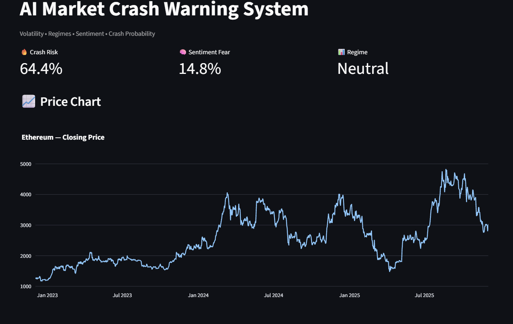

# AI Market Crash Warning System

A real-time market risk intelligence dashboard combining volatility modeling, unsupervised regime detection, and sentiment analysis.  
Designed to reflect the type of compact, multi-signal risk tools used inside quantitative hedge funds.

---

##  Project Summary

Markets move between calm, neutral, and stressed regimes.  
This system analyzes **price data**, **volatility structure**, and **news sentiment** to generate a real-time **Crash Risk Score** (0–100).

The model evaluates:

1. **Volatility Risk** – sudden increases in realized volatility  
2. **Market Regime** – clustering returns and volatility into structural states  
3. **Sentiment Weakness** – NLP on current financial headlines  

All signals are aggregated into a unified risk indicator and visualized using Streamlit.

---

##  Features

### **Market Data Pipeline**
- Pulls 3 years of daily asset data from Yahoo Finance  
- Computes:
  - Close-to-close returns  
  - 30-day realized volatility  
- Cleans missing values and stabilizes the dataset  

### **Regime Classification (Machine Learning)**
Unsupervised clustering using **KMeans** on:
- Daily returns  
- 30-day volatility  

Regimes are mapped to:
- **High-Stress (Red)**
- **Neutral (Yellow)**
- **Calm (Green)**

### **Sentiment Analysis (NLP)**
- Real-time financial headlines fetched from Yahoo Finance Search  
- VADER sentiment model to compute:
  - Polarity  
  - Compound score  
  - Fear Score (scaled sentiment weakness)

### **Crash Risk Model**
The final risk score weights:
- 50% → Volatility Risk  
- 30% → Sentiment Fear  
- 20% → Regime Risk  

Output is a **0–100 Crash Probability Index**.

### **Interactive Dashboard**
The Streamlit app displays:
- Price chart  
- 30-day volatility chart  
- Real-time risk metrics  
- Market headlines  
- Current regime classification  
- Sentiment status  

---

##  Tech Stack

**Languages & Tools:**  
Python, Streamlit, Pandas, NumPy, yfinance, Plotly, scikit-learn, NLTK

---

##  How to Run
pip install -r requirements.txt
streamlit run app.py
---

##  Use Cases

This project demonstrates:
- Real-time risk monitoring  
- Multi-factor modeling  
- Market regime classification  
- Applied NLP for financial signals  
- Interactive dashboards for decision support  

Works as a strong portfolio project for:
- Quantitative Research  
- Data Science  
- Risk Modeling  
- Financial Engineering  
- Market Analysis  

---

## Screenshots

### **1. Dashboard Overview**

### **2. Price Chart**

### **3. Volatility (30-Day Rolling)**

### **4. Regime Classification**

### **5. Sentiment Panel**

---
##  Live Demo
Try the full interactive dashboard here:

🔗 https://ai-crash-warning-system-rse6lqbxsuljz5qkst2kso.streamlit.app/

---
##  Future Improvements

- Integrate **FinBERT** for more accurate financial sentiment  
- Add options-based risk (VIX, skew, implied volatility)  
- Use LSTM / Transformer models for future regime forecasting  
- Multi-asset contagion detection (correlation stress)  
- Include macroeconomic data (yields, spreads, PMI, employment)  
- Portfolio-level risk aggregation  
- Shock scenarios & Monte Carlo stress simulation  

---

##  Author

**Swathi Pokuri**  
Data Science • Quantitative Modeling  
📧 Email: **swathicac1@gmail.com**  
🔗 GitHub: https://github.com/Spokuri2003  

---
